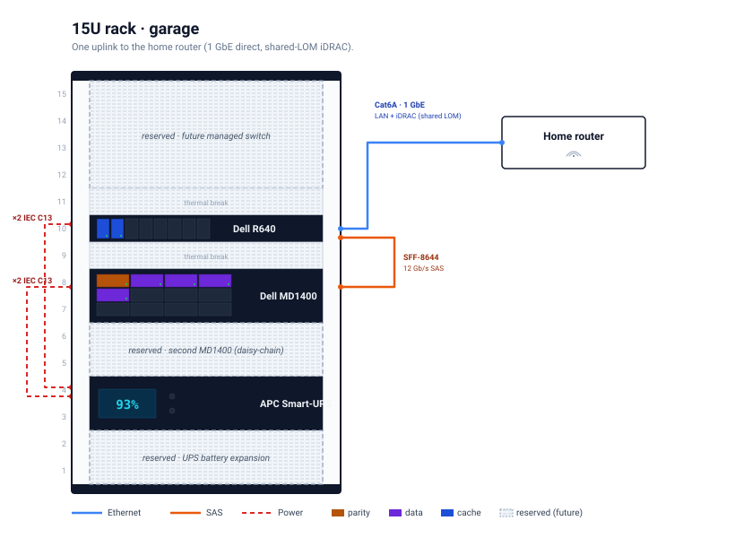
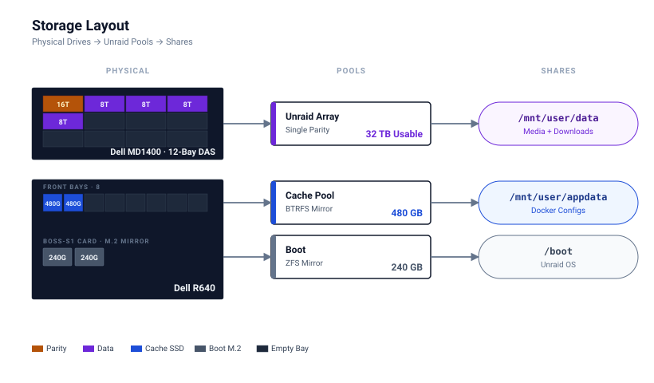
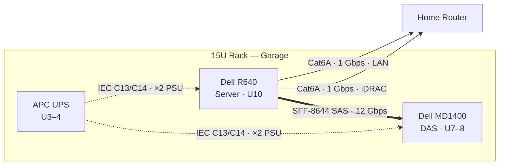
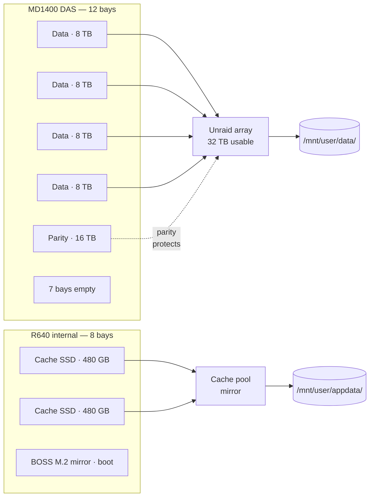
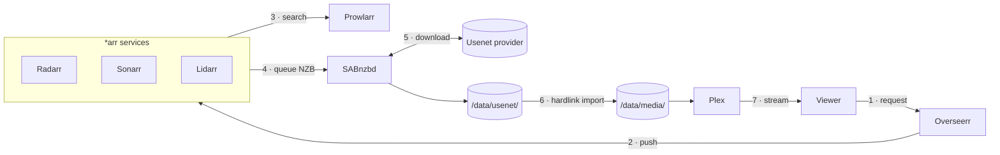
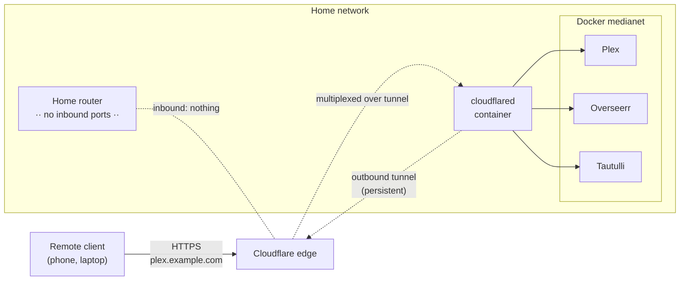

# Diagram drafts (revision 3)

**Not linked from nav.** Pivoted off Mermaid — moving to hand-crafted SVG (rack) + mingrammer/diagrams (flows, real product icons). One diagram landed for review; the other three are queued behind your aesthetic sign-off on #1.

---

## 1. Physical topology — SVG (candidate: top of `hardware.md`)

Rack faceplate detail (R640 8-bay, MD1400 12-bay grid with parity/data/empty color-coded, UPS LCD), single uplink with shared-LOM iDRAC, color-coded power/data/SAS lines, external home router.

Source: [assets/rack.svg](assets/rack.svg)

---

## 2. Storage pool layout — SVG (candidate: `hardware.md` storage section)

Physical drives → Unraid pools → shares. Same hand-SVG aesthetic as the rack: dark chassis with color-coded bay grids (parity amber, data purple, cache blue, empty slate), pool boxes with accent stripe, share pills with monospaced mount paths. Dashed amber connector for the "parity protects" relationship since parity isn't stored content.

Source: [assets/storage.svg](assets/storage.svg)

---

## 3. Docker stack + request flow — mingrammer (candidate: `software.md`)

Flow graph per feedback lesson #7 — auto-layout tool with real product logos, not hand-SVG. Source: [assets/diagrams/docker-stack.py](assets/diagrams/docker-stack.py). Output: `assets/docker-stack.png` (user renders via `python docker-stack.py` after `pip install diagrams` + icon download).

Structure: Viewer → Overseerr → *arr cluster → Prowlarr (search) / SABnzbd (NZB queue) → Usenet provider (dashed, external) → `/data/usenet` → hardlink into `/data/media` → Plex → back to Viewer. Numbered 1–7 matching the text flow in `software.md`.

---

## 4. External access boundary — mingrammer (candidate: `software.md` external-access section)

Illustrates the zero-open-ports property **and** the outbound-only paths (NNTP to Usenet, HTTPS to indexers). Source: [assets/diagrams/external-access.py](assets/diagrams/external-access.py). Output: `assets/external-access.png`.

Structure: Remote client → Cloudflare edge ↔ `cloudflared` (outbound persistent tunnel, dashed purple) → family-facing services (Plex, Overseerr, Tautulli). Admin-only subcluster (SAB, Prowlarr) reaches out independently to Usenet/indexers (dashed amber). Home router has a dashed red "No Inbound" arrow to nowhere, emphasising that no ingress passes through it.

---

## Icons

Both mingrammer diagrams expect PNG icons at `docs/assets/diagrams/icons/`. Suggested source: [walkxcode/dashboard-icons](https://github.com/walkxcode/dashboard-icons/tree/main/png). Required filenames are listed in each script's header docstring.

---

The existing Mermaid drafts for 2–4 are below for reference only; do not land them.

---

## (reference, do not land) ~~1. Physical topology — Mermaid r1~~

---

## 2. Storage pool layout (candidate: `hardware.md` storage section)

How physical drives map to Unraid's logical shares.

---

## 3. Docker stack + media-request flow (candidate: `software.md`)

Services, volumes, and the life of a content request from click to stream.

---

## 4. External access via Cloudflare Tunnel (candidate: `software.md` external-access section)

Illustrates the zero-open-ports property — the tunnel is established outbound by `cloudflared`, so nothing in the home router needs to be opened.

