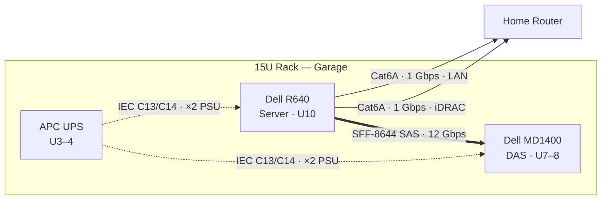
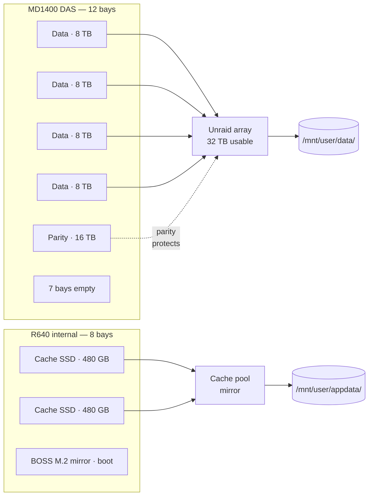
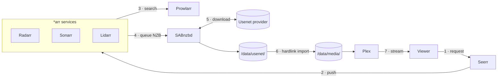
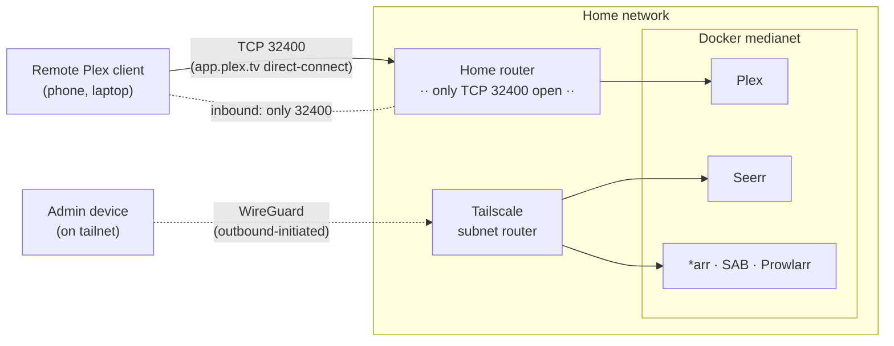

# Diagram drafts

**Not linked from nav.** Four candidate diagrams for the doc site. Pick which to keep; rejected drafts and this file get deleted afterward.

Destination notes for each diagram appear above it; change if a different home makes more sense.

---

## 1. Physical topology (candidate: top of `hardware.md`)

Rack contents + every cable that leaves the rack. Zooms out one level from the rack-layout table further down the page.

---

## 2. Storage pool layout (candidate: `hardware.md` storage section)

How physical drives map to Unraid's logical shares.

---

## 3. Docker stack + media-request flow (candidate: `software.md`)

Services, volumes, and the life of a content request from click to stream.

---

## 4. External access: Plex port-forward + Tailscale admin plane (candidate: `software.md` external-access section)

Illustrates the one-port-open property — Plex is forwarded directly on TCP 32400; every other service is reachable only over the tailnet.

